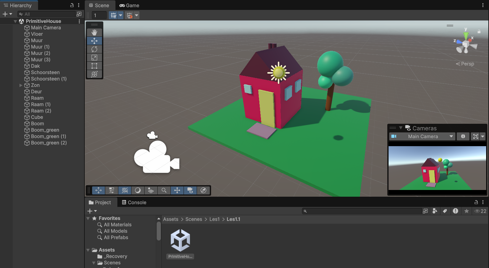

# Les1.1 Oefening 1.1A: Primitive Building Challenge

## Beschrijving
Ik heb een huis gebouwd met alleen basis GameObjects (cubes, spheres, cylinders).

## Wat ik heb geleerd
- Ik heb de Unity interface geleerd door een simpel huis met primitieve vormen te bouwen.

## Demo

