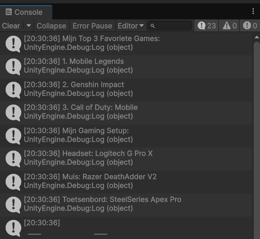
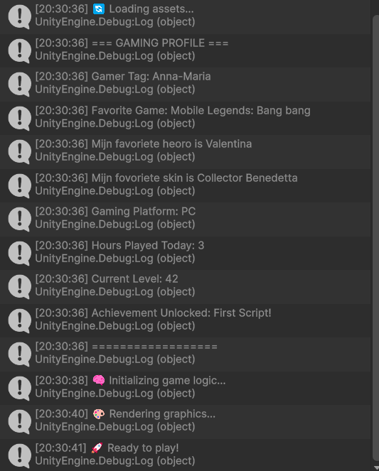
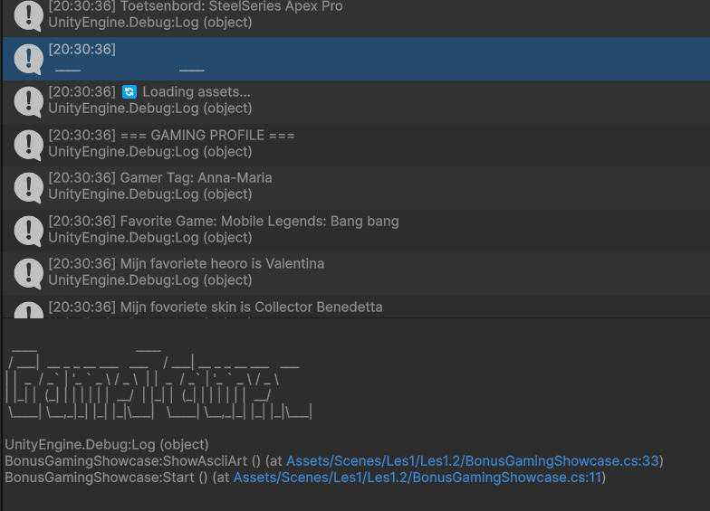

# Les1.2 Oefening 1.2A: Personal Gaming Profile Generator

## Beschrijving
Ik heb een script gemaakt dat mijn gaming informatie toont, zoals een Steam profiel.

## Wat ik heb geleerd
- Hoe ik Debug.Log() gebruik om berichten te tonen.
## Code 
```code
using UnityEngine;

public class GamerProfileDisplay : MonoBehaviour
{
    void Start()
    {
        // Gaming profiel informatie
        Debug.Log("=== GAMING PROFILE ===");
        Debug.Log("Gamer Tag: Anna-Maria");
        Debug.Log("Favorite Game: Mobile Legends: Bang bang");
        Debug.Log("Mijn favoriete heoro is Valentina");
        Debug.Log("Mijn fovoriete skin is Collector Benedetta");
        Debug.Log("Gaming Platform: PC");
        Debug.Log("Hours Played Today: 3");
        Debug.Log("Current Level: 42");
        Debug.Log("Achievement Unlocked: First Script!");
        Debug.Log("==================");
    }
```
## Demo


## Code (Bonus)
```code
using UnityEngine;
using System.Collections;

public class BonusGamingShowcase : MonoBehaviour
{

    void Start()
    {
        ShowFavorieteGames();
        ShowGamingSetup();
        ShowAsciiArt();
        StartCoroutine(LoadingEffect());
    }

    void ShowFavorieteGames()
    {
        Debug.Log("Mijn Top 3 Favoriete Games:");
        Debug.Log("1. Mobile Legends");
        Debug.Log("2. Genshin Impact");
        Debug.Log("3. Call of Duty: Mobile");
    }

    void ShowGamingSetup()
    {
        Debug.Log("Mijn Gaming Setup:");
        Debug.Log("Headset: Logitech G Pro X");
        Debug.Log("Muis: Razer DeathAdder V2");
        Debug.Log("Toetsenbord: SteelSeries Apex Pro");
    }

    void ShowAsciiArt()
    {
        Debug.Log(@"
  ____                          ____                      
 / ___|  __ _ _ __ ___   ___    / ___| __ _ _ __ ___   ___
| |  _  / _` | '_ ` _ \ / _ \  | |  _  / _` | '_ ` _ \ / _ \
| |_| |  (_| | | | | | |  __/  | |_| |  (_| | | | | | |  __/
 \____| \__,_|_| |_| |_|\___|   \____| \__,_|_| |_| |_|\___|
       ");
    }
    IEnumerator LoadingEffect()
    {
        string[] loadingMessages = {
           "🔄 Loading assets...",
           "🧠 Initializing game logic...",
           "🎨 Rendering graphics...",
           "🚀 Ready to play!"
       };
        foreach (string message in loadingMessages)
        {
            Debug.Log(message);
            yield return new WaitForSeconds(1.5f);
        }
    }
}
```
## Demo (Bonus)
