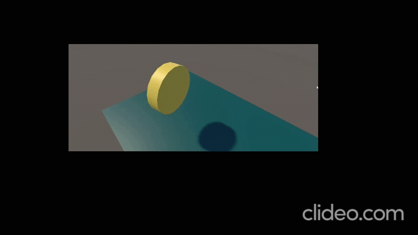

# Les2.1 Oefening 2.1A: Draaiend muntje (Coin)

## Beschrijving
Ik heb een muntje gemaakt dat automatisch draait, zoals in Mario.

## Wat ik heb geleerd
- Ik heb geleerd hoe ik een GameObject rond zijn eigen as laat draaien met een script.
## Demo

## Code
```code
using UnityEngine;

public class Rotate : MonoBehaviour
{
    public Vector3 rotateAmount;
    void Start()
    {
        Debug.Log("hallo Unity!");
    }


    void Update()
    {
        transform.Rotate(rotateAmount * Time.deltaTime);
    }
}
```