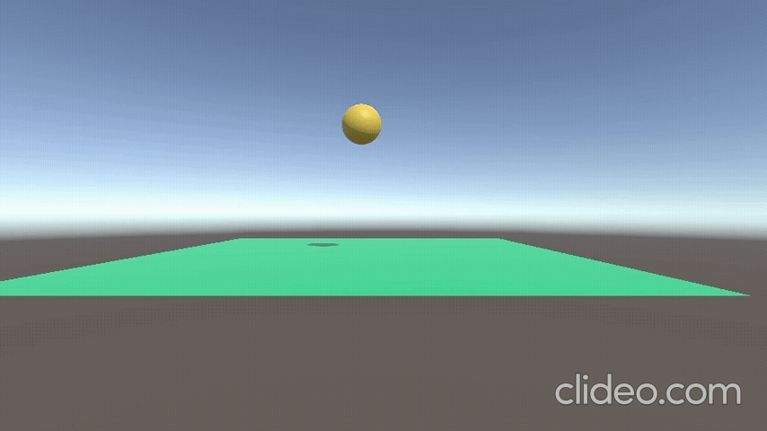

# Les3.1 Oefening 3.1A: Vallende Bal mat stuiter

## Beschrijving
Ik heb een bal gemaakt die door zwartekracht naar beneden valt en sluitert op de vloer, vergelijkbaar met een sluiterbal in Angry Birds.

## Wat ik heb geleerd
- Ik heb geleerd hoe ik in 3D een object laat vallen en realistisch laat sluiteren met behulp van physics.
## Demo

## Code
```code
using UnityEngine;
using System.Collections;

public class BreakablePlatform : MonoBehaviour
{
    
    void OnCollisionEnter(Collision collision)
    {
        IEnumerator BreakAfterDelay()
        {
            yield return new WaitForSeconds(6f);
            Destroy(gameObject);
        } 
        if (collision.gameObject.CompareTag("Ball"))
        {
            StartCoroutine(BreakAfterDelay());
        }
    }

   
}
```