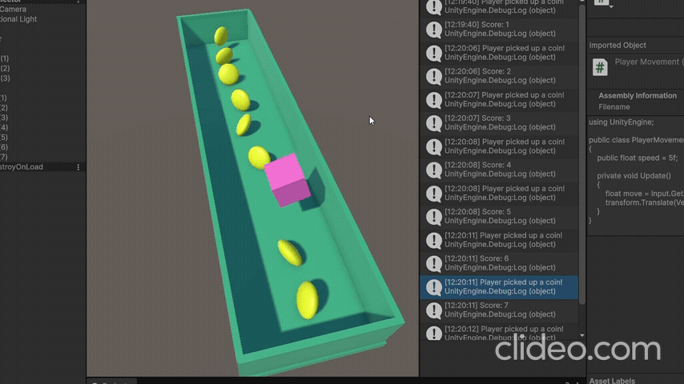

# Les4.1 Oefening 2.1A: Draaiend muntje (Coin)

## Beschrijving
Ik heb een muntje gemaakt dat automatisch draait, zoals in Mario.

## Wat ik heb geleerd
- Ik heb geleerd hoe ik een GameObject rond zijn eigen as laat draaien met een script.
## Demo

## Code (voor cube(Player))
```code
using UnityEngine;

public class PlayerMovement : MonoBehaviour
{
    public float speed = 5f;

    private void Update()
    {
        float move = Input.GetAxis("Horizontal");
        transform.Translate(Vector3.right * move * speed * Time.deltaTime);
    }
}
```
## Code (voor Coin)
```code
using UnityEngine;

public class CoinPickup2 : MonoBehaviour
{
    private void OnTriggerEnter(Collider other)
    {
        if (other.CompareTag("Player"))
        {
            Debug.Log("Player picked up a coin!");
            ScoreManager2.instance.AddScore(1);
            Destroy(gameObject);
        }
    }

}
```
## Code (Score Manager)
```code
using UnityEngine;

public class ScoreManager2 : MonoBehaviour
{
    public static ScoreManager2 instance;
    private int score = 0;

    private void Awake()
    {
        instance = this;
    }

    public void AddScore(int amount)
    {
        score += amount;
        Debug.Log("Score: " + score);
    }
}
```
