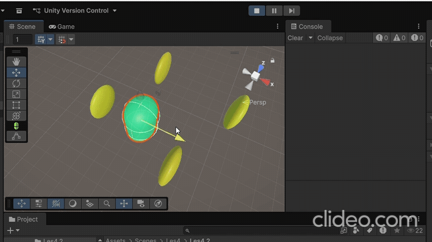

# Les4.2 Oefening 4.2A: Coin Pickup System

## Beschrijving
Ik heb een script gemaakt dat punten toevoegt als de speler een muntje oppakt.
## Wat ik heb geleerd
- Ik heb met OnTriggerEnter geoefend door een muntjeverzamelsysteem te maken.
## Demo

## Code (voor Coin)
```code
using UnityEngine;

public class CoinPickup : MonoBehaviour
{
    public int coinValue = 10;

    private void OnTriggerEnter(Collider other)
    {
        if (other.CompareTag("Player"))
        {
            Debug.Log("Player picked up a coin!");
            ScoreManager.instance.AddScore(coinValue);
            Destroy(gameObject);
        }
    }
}
```
## Code (Score Manager)
```code
using UnityEditor.UIElements;
using UnityEngine;

public class ScoreManager : MonoBehaviour
{
    public static ScoreManager instance;
    private int score = 0;

    private void Awake()
    {
        instance = this;
    }

    public void AddScore(int amount)
    {
        score += amount;
        Debug.Log("Score: " + score);
    }
}
```