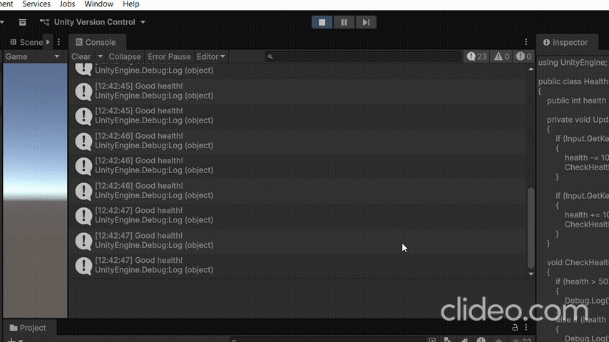

# Les5.1 Oefening 5.1A: Health Status Indicator

## Beschrijving
Ik heb een script gemaakt dat de gezondheid van een speler controleert en verschillende berichten toont afhankelijk van de waarde.

## Wat ik heb geleerd
- Ik heb net if en else geoefend door een health status systeem te maken.
## Demo

## Code
```code
using UnityEngine;

public class HealthStatus2 : MonoBehaviour
{
    public int health = 100;

    private void Update()
    {
        if (Input.GetKeyDown(KeyCode.Q))
        {
            health -= 10;
            CheckHealth();
        }

        if (Input.GetKeyDown(KeyCode.W))
        {
            health += 10;
            CheckHealth();
        }
    }

    void CheckHealth()
    {
        if (health > 50)
        {
            Debug.Log("Good health!");
        }
        else if (health > 20)
        {
            Debug.Log("Warning: Low health!");
        }
        else if (health > 0)
        {
            Debug.Log("Critical: Very low health!");
        }
        else
        {
            Debug.Log("Game Over!");
        }
    }
}
```