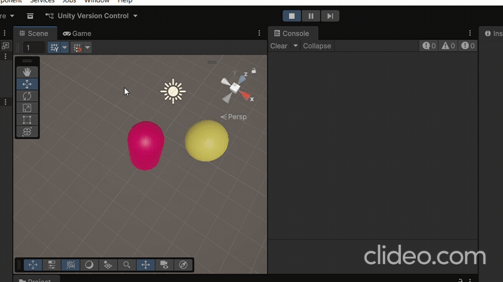

# Les5.2 Oefening 5.2A: Slimme Pickup Sysyteem

## Beschrijving
Ik heb een script gemaakt waarin een speler allen een health potion kan oppakken als zijn health niet vol is.

## Wat ik heb geleerd
- Ik heb input, if-statements en colision detection gecombeneerd door een pickup systeem te maken dat alleen werkt onder bepaalde voorwaarden.
## Demo

## Code
```code
using UnityEngine;

public class HealthPickup1 : MonoBehaviour
{
    public int healAmount = 5;

    private void OnTriggerEnter(Collider other)
    {
        if (other.CompareTag("Player"))
        {
            PlayerHealth playerHealth = other.GetComponent<PlayerHealth>();
            if (playerHealth != null && playerHealth.health < playerHealth.maxHealth)
            {
                playerHealth.health += healAmount;
                Debug.Log("Health restored!");
                Debug.Log("Health is now: " + playerHealth.health);
                Destroy(gameObject);
            }
        }
    }
}
```
## Code 2
```code
using UnityEngine;

public class PlayerHealth : MonoBehaviour
{
    public int health = 5;
    public int maxHealth = 10;
}
```

